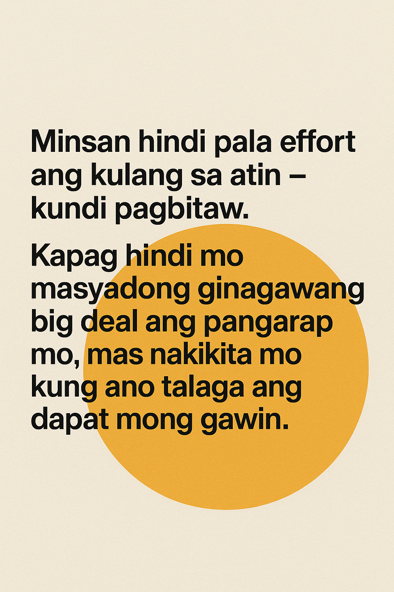

3-Step “No Big Deal” Technique

(Para sa mga bagay na gusto mong maabot, pero ayaw mong ma-stress)

1. Huwag masyadong seryosohin

Gusto mo? Oo.
Pero huwag mo siyang gawing “life-or-death.”
Kapag masyado mong hinihigpitan, mas lalo siyang umiilag.
Relax ka lang — parang normal na bagay lang na darating sa tamang oras.

2. Ayusin muna ang loob, hindi ang labas

Bago ka kumilos, ayusin mo muna yung state mo:
– kalmado,
– kampante,
– hindi nagmamadali,
– hindi natatakot ma-miss out.

I-visualize mo yung sarili mong parang andun ka na sa gusto mong resulta.
Hindi para “mag-manifest,”
kundi para bumalik sa tamang mindset.

3. Gawin mo lang yung maliit pero tama

Hindi kailangan ng malaking effort.
Kadalasan, isang maliit, simple, at tamang hakbang lang per day.
‘Yung hindi sapilitan, hindi pilit, hindi toxic.
Just natural flow.

Kapag hindi big deal sa’yo, mas mabilis dumating yung mga pagkakataon.
